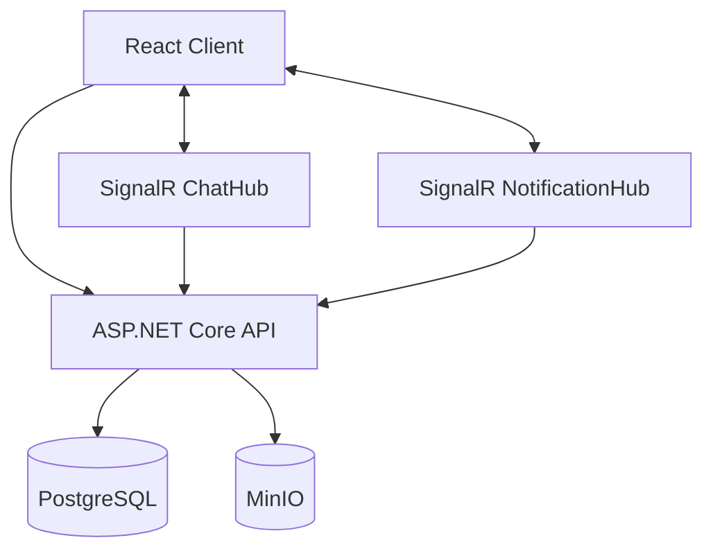

# Messenger

> Полноценный realtime-мессенджер с личными и групповыми чатами, обменом сообщениями и файлами, уведомлениями и синхронизацией состояния между клиентами.

**[Демо](https://vitaliyarmss.github.io/messenger-frontend)** · **[Backend](https://github.com/VitaliyArmss/messenger-backend)** · **[Frontend](https://github.com/VitaliyArmss/messenger-frontend)** · **[Документация](https://github.com/VitaliyArmss/messenger-project/blob/main/docs/architecture.md)**

---

## О проекте

Messenger — учебный full-stack проект, разработанный с нуля: от модели данных и backend-логики до realtime-коммуникации, object storage и развёртывания на VPS.

Основной фокус проекта — практическая реализация задач, которые возникают в приложениях с постоянной синхронизацией состояния между несколькими клиентами:

- realtime-доставка сообщений и событий;
    
- синхронизация изменений групп и списка чатов;
    
- управление непрочитанными сообщениями и статусами прочтения;
    
- аутентификация с жизненным циклом access/refresh token;
    
- защищённая работа с приватными вложениями;
    
- работа с историей сообщений без загрузки всей переписки;
    
- разделение business logic, API и realtime-слоя;
    
- самостоятельное развёртывание backend-инфраструктуры.
    

---

## Возможности

### Чаты и сообщения

- личные и групповые чаты;
    
- realtime-обмен сообщениями;
    
- редактирование и удаление сообщений;
    
- системные сообщения;
    
- история сообщений с пагинацией;
    
- переход к сообщению и загрузка истории относительно него;
    
- поиск первого непрочитанного сообщения;
    
- статусы прочтения;
    
- пакетная отметка сообщений как прочитанных.
    

### Группы

- создание групповых чатов;
    
- добавление и удаление участников;
    
- выход из группы;
    
- владелец группы;
    
- изменение названия и аватара;
    
- синхронизация изменений группы в realtime.
    

### Пользователи и профиль

- регистрация и авторизация;
    
- редактирование профиля;
    
- username;
    
- аватар;
    
- поиск пользователей.
    

### Файлы

- загрузка вложений;
    
- изображения, медиа, аудио и обычные файлы;
    
- аватары пользователей и групп;
    
- хранение бинарных объектов в MinIO;
    
- хранение метаданных файлов в PostgreSQL;
    
- проверка доступа к приватным вложениям через backend.
    

---

## Технологический стек

### Backend

- C#
    
- ASP.NET Core
    
- Entity Framework Core
    
- SignalR
    
- JWT
    

### Frontend

- React
    
- JavaScript
    
- Axios
    
- SignalR Client
    
- Vite
    

### Data & Storage

- PostgreSQL
    
- MinIO
    

### Infrastructure

- Docker
    
- Docker Compose
    
- Nginx
    
- VPS
    
- GitHub Actions
    
- GitHub Pages
    

---

## Репозитории проекта

Backend и frontend находятся в отдельных репозиториях, что позволяет независимо развивать каждую часть приложения.

### Backend

**[messenger-backend →](https://chatgpt.com/c/YOUR_BACKEND_REPO_URL)**

ASP.NET Core API, business logic, SignalR, EF Core, PostgreSQL, JWT и MinIO.

### Frontend

**[messenger-frontend →](https://chatgpt.com/c/YOUR_FRONTEND_REPO_URL)**

React-клиент, API layer, authentication state, SignalR connections и пользовательский интерфейс.

### Демо

**[Открыть приложение →](https://chatgpt.com/c/YOUR_DEMO_URL)**

---

## Что интересно технически

### Два realtime-канала

Realtime-коммуникация разделена на два SignalR Hub:

```text
ChatHub
    ↓
события внутри конкретных чатов

NotificationHub
    ↓
пользовательские уведомления и изменения,
не привязанные к открытому чату
```

Такой подход позволяет разделить chat-level и user-level communication.

---

### Работа с историей сообщений

История сообщений не ограничивается обычным `skip/take`.

Backend поддерживает загрузку сообщений:

```text
относительно конкретного сообщения
в определённом направлении
от первого непрочитанного сообщения
```

Это позволяет реализовывать сценарии вроде перехода к непрочитанному сообщению и дозагрузки истории в обе стороны, не загружая всю переписку целиком.

---

### Отдельное хранилище файлов

Файлы отделены от relational data:

```text
PostgreSQL
    └── metadata

MinIO
    └── binary objects
```

При получении вложения frontend обращается к backend, а backend сначала проверяет права пользователя на соответствующий чат.

Таким образом, MinIO не используется как открытое публичное файловое хранилище приложения.

---

### Refresh token lifecycle

Авторизация построена вокруг пары:

```text
Access Token
+
Refresh Token
```

При обновлении access token старый refresh token отзывается, после чего создаётся новая пара токенов.

На frontend этот lifecycle интегрирован в Axios interceptor, поэтому истечение access token не требует повторного входа пользователя.

---

### Разделение backend-логики

Основная бизнес-логика вынесена в сервисный слой:

```text
AuthService
ChatService
MessageService
UserService
AttachmentService
JwtService
```

REST API и SignalR работают поверх этого слоя, а взаимодействие с базой данных и внешними сервисами не смешивается с transport logic.

---

## Архитектура



Production-инфраструктура:

```text
                         Internet
                            │
                            ▼
                          Nginx
                         /     \
                        /       \
                       ▼         ▼
              ASP.NET Core    SignalR
                    │
              ┌─────┴─────┐
              ▼           ▼
         PostgreSQL      MinIO
```

Подробное описание компонентов и потоков данных:

**[Архитектура →](https://chatgpt.com/c/docs/architecture.md)**

---

## Deployment

Backend развёрнут на VPS в Docker Compose.

Nginx используется как внешний reverse proxy, а PostgreSQL и MinIO работают внутри backend-инфраструктуры.

Frontend размещён отдельно через GitHub Pages.

Сборка и публикация frontend автоматизированы через GitHub Actions:

```text
push to main
     ↓
install dependencies
     ↓
production build
     ↓
GitHub Pages
```

Подробнее:

**[Deployment →](https://chatgpt.com/c/docs/deployment.md)**

---

## Документация

Подробные технические материалы вынесены из README в отдельные документы.

|Документ|Содержание|
|---|---|
|[Architecture](https://chatgpt.com/c/docs/architecture.md)|Архитектура и взаимодействие компонентов|
|[Authentication](https://chatgpt.com/c/docs/authentication.md)|JWT, refresh tokens и auth lifecycle|
|[Realtime](https://chatgpt.com/c/docs/realtime.md)|SignalR, Hub'ы, groups и realtime-события|
|[Database](https://chatgpt.com/c/docs/database.md)|Модель данных и связи сущностей|
|[File Storage](https://chatgpt.com/c/docs/file-storage.md)|MinIO, attachments и контроль доступа|
|[Deployment](https://chatgpt.com/c/docs/deployment.md)|VPS, Docker Compose, Nginx и CI/CD|
|[Security](https://chatgpt.com/c/docs/security.md)|Аутентификация, авторизация и ограничения|
|[Architecture Decisions](https://chatgpt.com/c/docs/decisions.md)|Ключевые технические решения и их причины|

---

## Статус проекта

Проект находится в активной разработке.

Дальнейшее развитие проекта планируется в направлениях:

- automated testing;
    
- observability и logging;
    
- улучшение production security;
    
- оптимизация работы с большими файлами;
    
- дальнейшее развитие CI/CD и инфраструктуры.
    
