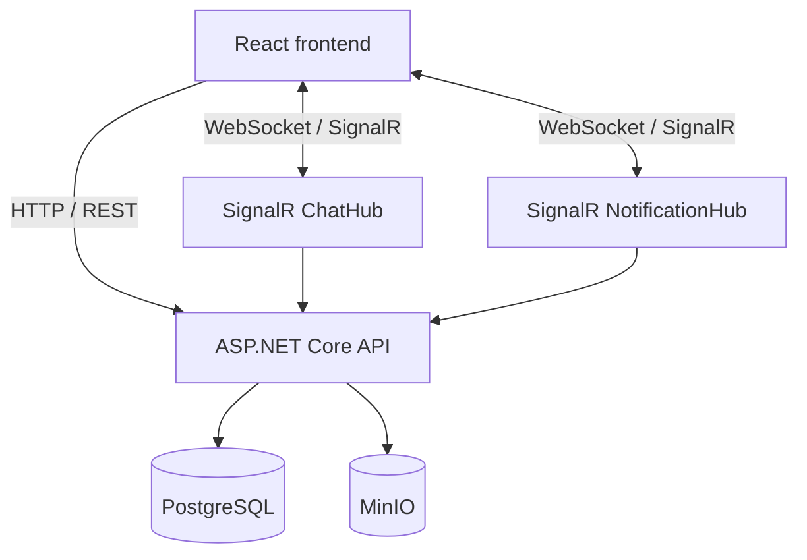
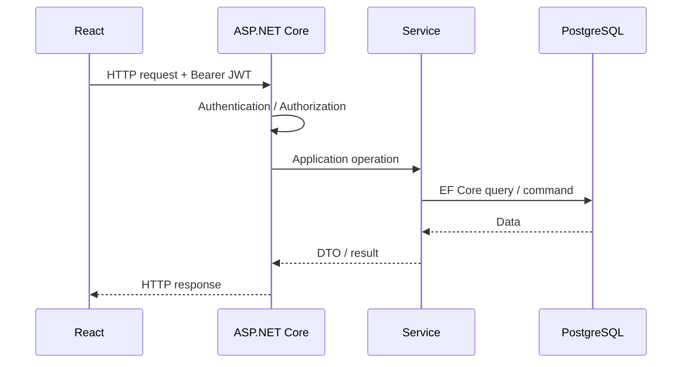
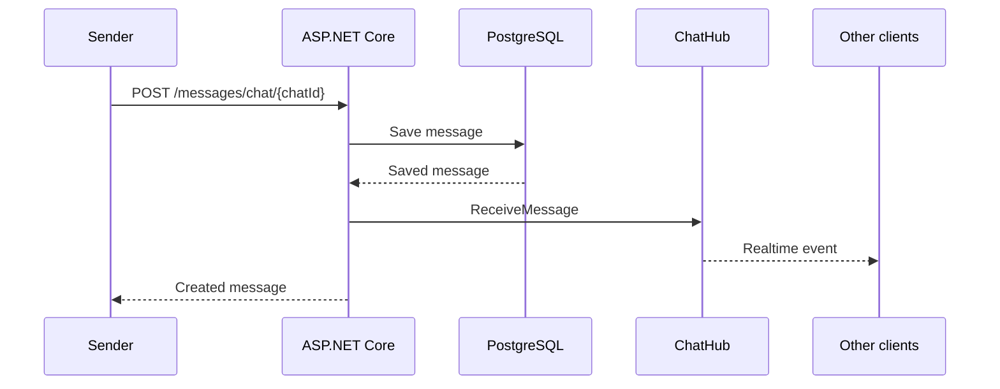

# Архитектура проекта

## 1. Общая архитектура

Messenger состоит из двух прикладных частей и инфраструктурного окружения:



Frontend и backend развиваются в отдельных GitHub-репозиториях. Для проекта документация ведётся отдельно и связывает обе части в единую систему.

В production frontend размещён отдельно на GitHub Pages, а backend-инфраструктура развёрнута на VPS.

---

## 2. Основные компоненты

### Frontend

React-приложение отвечает за пользовательский интерфейс, состояние авторизации, REST-взаимодействие с backend и две SignalR connection.

В API-слое frontend логика разделена по доменам:

```text
api/
├── auth.js
├── users.js
├── chats.js
├── messages.js
├── attachments.js
└── signalr.js
```

REST-запросы централизованы через Axios instance. Authorization header добавляется interceptor'ом, а ответы `401` обрабатываются через refresh-token flow.

### ASP.NET Core

Backend выполняет сразу несколько ролей:

- REST API;
- application/business logic;
- authentication и authorization;
- realtime gateway через SignalR;
- работа с PostgreSQL через EF Core;
- работа с MinIO;
- формирование DTO и response models.

Основная бизнес-логика вынесена в сервисы:

```text
IAuthService
IAttachmentService
IChatService
IMessageService
IUserService
IJwtService
```

Concrete implementations зарегистрированы через Dependency Injection.

### PostgreSQL

PostgreSQL используется для основной relational data модели:

```text
User
Chat
ChatMember
Message
MessageReadStatus
Attachment
RefreshToken
```

### MinIO

MinIO используется для бинарных объектов. PostgreSQL хранит metadata attachment'ов, а сами файлы находятся в object storage.

### SignalR

Realtime-часть разделена на два hub:

```text
/chatHub
/notificationHub
```

`ChatHub` используется для событий конкретных чатов, `NotificationHub` — для пользовательских уведомлений и изменений состояния, которые должны доставляться пользователю независимо от открытого чата.

---

## 3. Backend architecture

Backend построен вокруг разделения transport layer и application logic:

```text
HTTP Controller / SignalR Hub
             ↓
        Service Interface
             ↓
      Service Implementation
          ↙         ↘
       EF Core      external services
          ↓              ↓
     PostgreSQL        MinIO
```

Например, работа с сообщением концептуально выглядит так:

```text
MessagesController
      ↓
 IMessageService
      ↓
 MessageService
   ↙       ↓       ↘
 EF Core  SignalR  NotificationHub
```

Такой подход позволяет не помещать application logic непосредственно в controller или hub.

---

## 4. Жизненный цикл REST-запроса

Типичный защищённый запрос проходит следующие уровни:



Для операций с файлами service layer дополнительно обращается к MinIO.

---

## 5. Realtime flow

Realtime-события не заменяют REST полностью. В проекте эти механизмы выполняют разные задачи.

REST используется для операций с данными:

```text
create / read / update / delete
```

SignalR используется для доставки изменений другим подключённым клиентам:

```text
new message
message edited
message deleted
read status changed
group updated
members changed
notifications
```

Например:



---

## 6. Chat и notification communication

### ChatHub

`ChatHub` защищён `[Authorize]` и работает с SignalR groups. Connection может присоединиться к группе конкретного чата, после чего события chat-level отправляются всем connections внутри неё.

```text
Chat 123
   ↓
SignalR Group "123"
   ├── Connection A
   ├── Connection B
   └── Connection C
```

### NotificationHub

`NotificationHub` также защищён `[Authorize]`, но сообщения адресуются отдельному пользователю через `Clients.User(...)`.

Это используется, например, для:

- обновления списка чатов;
- уведомлений о новом сообщении;
- удаления группы;
- изменения непрочитанных сообщений;
- изменения данных пользователя.

---

## 7. Frontend architecture

Frontend разделён на несколько зон ответственности.

```text
src/
├── api/          REST + SignalR
├── components/   UI components
├── context/      application-wide state
├── hooks/        reusable logic
├── pages/        application screens
└── css/          presentation
```

### API layer

API-клиенты разделены по доменам. Например, работа с сообщениями не смешана с auth API, а attachment operations вынесены отдельно.

### Context

Аутентификация и текущий пользователь доступны компонентам через `AuthContext`.

### Hooks

Повторно используемая логика, например загрузка защищённых avatar изображений, вынесена в hooks.

---

## 8. Production topology

```text
                           Internet
                              │
                              ▼
                           Nginx
                         /       \
                        /         \
                       ▼           ▼
                ASP.NET Core     SignalR
                    │
             ┌──────┴──────┐
             ▼             ▼
        PostgreSQL        MinIO
```

Frontend при этом работает отдельно:

```text
GitHub repository
       ↓
GitHub Actions
       ↓
Production build
       ↓
GitHub Pages
```

Таким образом, frontend hosting и backend infrastructure не связаны в один deployment artifact.

---

## 9. Дополнительные детали

Подробная реализация отдельных подсистем описана в:

- [Authentication](./authentication.md)
- [Realtime](./realtime.md)
- [Database](./database.md)
- [File Storage](./file-storage.md)
- [Deployment](./deployment.md)
- [Security](./security.md)
- [Architecture Decisions](./decisions.md)
