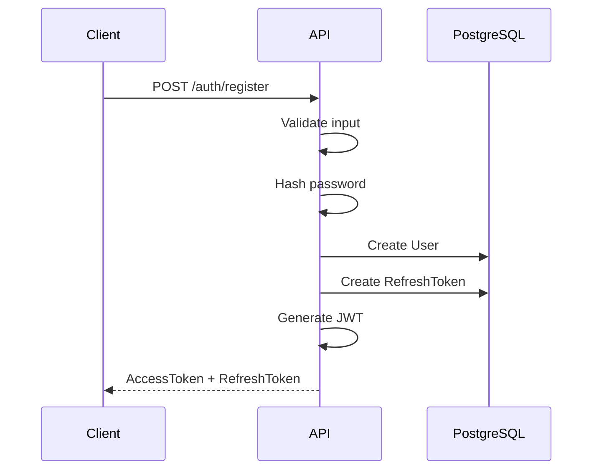
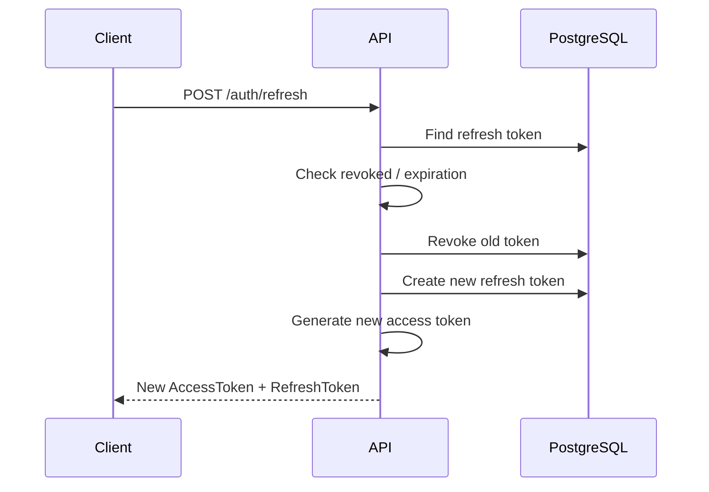
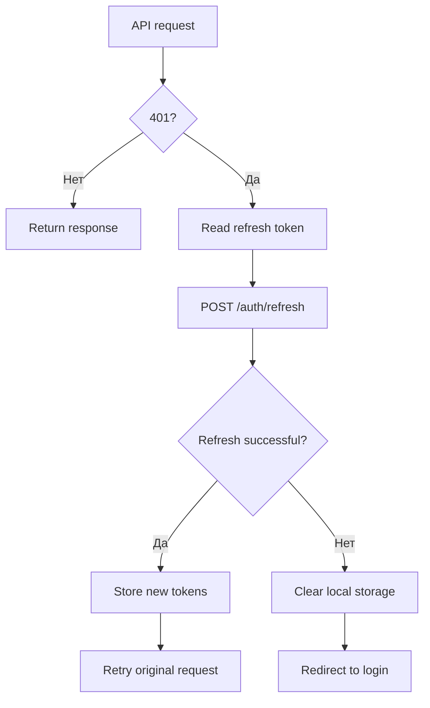

# Аутентификация

## 1. Общая модель

Аутентификация построена вокруг пары:

```text
Access Token
+
Refresh Token
```

Access token используется для доступа к защищённым API и SignalR. Refresh token используется для получения новой пары токенов после истечения access token.

На backend JWT валидируется по issuer, audience, lifetime и signing key.

---

## 2. Регистрация

При регистрации backend:

1. проверяет, что пользователь с указанным email не существует;
2. создаёт `User`;
3. хеширует пароль через `PasswordHasher<User>`;
4. сохраняет пользователя в PostgreSQL;
5. создаёт refresh token;
6. генерирует access token;
7. возвращает токены клиенту.

Упрощённая схема:



---

## 3. Login

Во время login backend находит пользователя по email и проверяет переданный пароль против сохранённого hash.

После успешной проверки создаются:

- access token;
- refresh token;
- время окончания действия access token.

```text
POST /auth/login
       ↓
find user
       ↓
verify password
       ↓
create refresh token
       ↓
generate JWT
       ↓
return tokens
```

---

## 4. Access Token

JWT используется как Bearer token.

Backend проверяет:

```text
ValidateIssuer
ValidateAudience
ValidateLifetime
ValidateIssuerSigningKey
```

В token используются identity claims пользователя, которые затем доступны приложению через текущую user identity.

---

## 5. Refresh Token

Refresh token хранится на backend в сущности `RefreshToken`.

Модель содержит:

```text
Id
Token
UserId
ExpiresAt
IsRevoked
CreatedAt
```

То есть backend может не только проверить срок действия токена, но и отозвать его.

---

## 6. Rotation

При обновлении access token старый refresh token не используется повторно.

Flow:



Старый refresh token помечается `IsRevoked = true`, после чего создаётся новый.

---

## 7. Logout

Logout отзывает активные refresh tokens пользователя.

Концептуально:

```text
Logout
  ↓
find user's active refresh tokens
  ↓
IsRevoked = true
```

Access token при этом естественным образом продолжает жить до истечения срока действия, а дальнейшее обновление с отозванными refresh tokens невозможно.

---

## 8. Authentication для SignalR

Оба SignalR Hub защищены `[Authorize]`.

На backend JWT Bearer configuration отдельно обрабатывает access token, переданный для `/chatHub` и `/notificationHub`.

Frontend создаёт SignalR connections через `accessTokenFactory`:

```text
React
  ↓
HubConnectionBuilder
  ↓
accessTokenFactory
  ↓
JWT
  ↓
SignalR endpoint
```

---

## 9. Frontend token lifecycle

Frontend использует Axios interceptors.

### Перед запросом

Interceptor получает `accessToken` и добавляет:

```http
Authorization: Bearer <token>
```

### Если API вернул 401



Для публичных auth endpoints refresh retry не применяется.

---

## 10. Текущие ограничения

### Хранение токенов на frontend

Текущая реализация хранит access token и refresh token в `localStorage`.

Для более строгого production-подхода можно рассмотреть перенос refresh-token механизма в `HttpOnly` + `Secure` cookie и дальнейшее разделение жизненного цикла access и refresh credentials.

### Отсутствие rate limiting

В текущей реализации отдельный rate limiting для login/register endpoints не выделен как самостоятельный механизм.

### Тестовое покрытие

Автоматические unit/integration tests в текущем проекте не покрывают весь authentication flow.