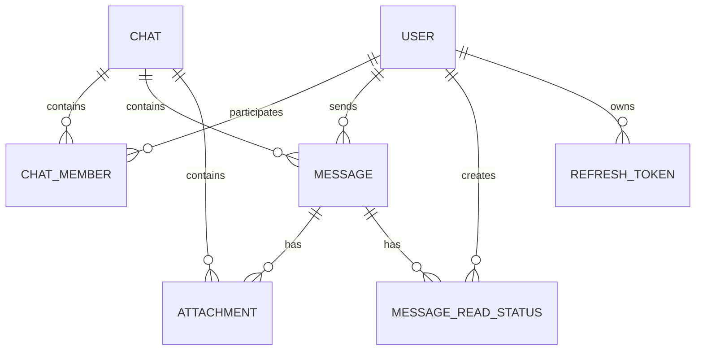

# Database

## 1. Общая модель

Основная relational модель строится вокруг пользователей, чатов и сообщений.



---

## 2. User

`User` хранит основную информацию пользователя:

```text
Id
Name
UserName
Email
PasswordHash
AvatarUrl
CreatedAt
```

Связи пользователя:

- участие в чатах через `ChatMember`;
- отправленные сообщения;
- refresh tokens;
- записи read status через user identity.

Пароль хранится в виде hash, а не в открытом виде.

---

## 3. Chat

`Chat` представляет как личный, так и групповой чат.

Ключевые поля:

```text
Id
Name
IsGroup
IsInitialised
OwnerId
CreatedAt
AvatarUrl
```

В личном чате отображаемое имя и avatar могут определяться через второго участника.

Для группового чата используются собственные `Name`, `AvatarUrl` и `OwnerId`.

---

## 4. ChatMember

Связь `User ↔ Chat` реализована отдельной сущностью `ChatMember`.

```text
User
  │
  └── ChatMember ── Chat
```

Это позволяет хранить дополнительную информацию о membership, например:

```text
JoinedAt
```

Для `ChatMember` в EF Core используется составной ключ:

```text
(UserId, ChatId)
```

---

## 5. Message

`Message` относится к конкретному чату и содержит:

```text
Id
ChatId
SenderId
Text
CreatedAt
IsEdited
IsDeleted
IsSystem
```

Также у сообщения есть коллекция `Attachments`.

### Soft delete

Удаление сообщения не означает физическое удаление строки.

Используется:

```text
IsDeleted = true
```

При выборке обычной истории удалённые сообщения исключаются через условие `!m.IsDeleted`.

### System messages

Отдельный флаг:

```text
IsSystem
```

позволяет отличать системные сообщения от сообщений пользователя.

Это используется, например, для сообщений о создании группы или изменении состава участников.

---

## 6. MessageReadStatus

Read state хранится отдельно:

```text
MessageReadStatus
├── MessageId
├── UserId
└── ReadAt
```

Смысл модели:

```text
Message #100
   ├── User A → read at 12:01
   ├── User B → read at 12:03
   └── User C → not read yet
```

Для сущности используется составной ключ:

```text
(MessageId, UserId)
```

Это соответствует модели, в которой один пользователь не должен иметь несколько независимых read-state записей для одного сообщения.

---

## 7. Attachment

Attachment содержит metadata файла:

```text
Id
MessageId
ChatId
Url
FileName
ContentType
Size
IsAvatar
Type
CreatedAt
```

При этом бинарное содержимое находится не в PostgreSQL, а в MinIO.

`Type` разделяет файл на категории:

```text
File
Media
Sound
```

---

## 8. RefreshToken

Refresh token является отдельной сущностью:

```text
RefreshToken
├── Id
├── Token
├── UserId
├── ExpiresAt
├── IsRevoked
└── CreatedAt
```

Это позволяет серверу хранить состояние refresh credentials и отзывать их.

---

## 9. Message loading

Backend поддерживает несколько способов чтения истории.

### Обычная пагинация

```text
skip
take
```

### Around message

```text
chatId + messageId + count
```

Backend получает сообщения до и после anchor-сообщения и собирает их в хронологический список.

### Direction

```text
older
newer
```

Используется для дозагрузки конкретной стороны истории.

### First unread

Backend отдельно находит самое старое непрочитанное сообщение для пользователя, исключая системные и удалённые сообщения.

---

## 10. Composite keys

В модели явно настроены два важных composite key:

```text
ChatMember
(UserId, ChatId)

MessageReadStatus
(MessageId, UserId)
```

Это позволяет представить membership и read state как уникальные связи.

---

## 11. EF Core

Доступ к PostgreSQL реализован через Entity Framework Core и Npgsql.

`AppDbContext` содержит `DbSet` для основных сущностей и конфигурацию модели.

Для design-time операций есть `AppDbContextFactory`, которая получает connection string из environment configuration и создаёт контекст для migration tooling.

---

## 12. Migrations

Изменения схемы базы данных оформляются через Entity Framework Core migrations.

Типичный workflow:

```bash
dotnet ef migrations add <MigrationName>
dotnet ef database update
```

При запуске приложения также выполняется применение pending migrations через `Database.Migrate()`.

Это уменьшает зависимость deployment от ручного выполнения SQL-скриптов.

---

## 13. Важные особенности модели

### Почему ChatMember — отдельная сущность

Membership является самостоятельным объектом домена: пользователь может состоять в нескольких чатах, чат содержит многих пользователей, а membership имеет собственный `JoinedAt`.

### Почему read status отдельная сущность

Read state зависит сразу от двух объектов — сообщения и пользователя. Размещение этого состояния непосредственно в `Message` не позволило бы моделировать разные состояния прочтения одного сообщения для разных пользователей.

### Почему Attachment отделён от Message

Одно сообщение может содержать несколько вложений, а отдельная модель позволяет хранить file metadata независимо от текста сообщения.