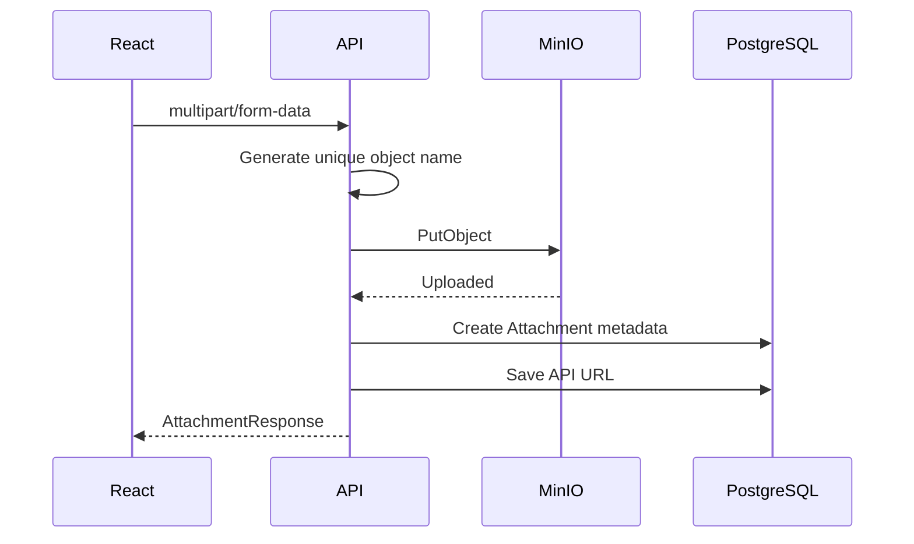
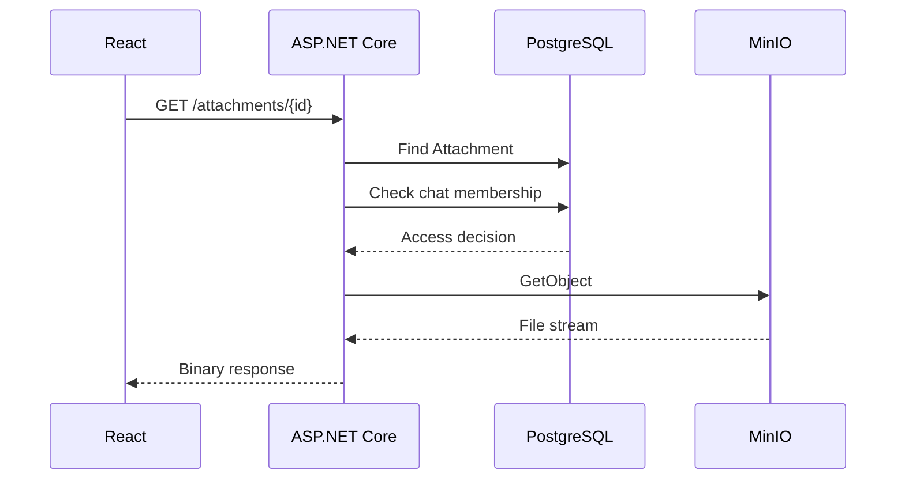

# File Storage

## 1. Архитектура

Файлы не хранятся как binary data внутри PostgreSQL.

Используется разделение:

```text
                    Upload
Frontend ─────────────────────────→ ASP.NET Core
                                      │
                         ┌────────────┴────────────┐
                         ▼                         ▼
                    PostgreSQL                   MinIO
                    metadata                    binary object
```

PostgreSQL отвечает за metadata и связи файла с чатом/сообщением, MinIO — за само содержимое.

---

## 2. FileWorker

Работа с MinIO централизована в `FileWorker`.

Он выполняет базовые object-storage операции:

```text
UploadFileAsync
DownloadFileAsync
DeleteFileAsync
```

При upload используется MinIO `PutObject`, при download — `GetObject`, а metadata объекта может быть получена через `StatObject`.

---

## 3. Attachment model

В PostgreSQL хранится `Attachment`:

```text
Id
MessageId
ChatId
Url
FileName
ContentType
Size
IsAvatar
Type
CreatedAt
```

Связь может быть:

```text
Attachment → Message
```

или использоваться для avatar/chat-related файла через `ChatId` и `IsAvatar`.

---

## 4. Upload flow

При загрузке attachment backend:

1. проверяет наличие файла;
2. создаёт уникальное object name на основе GUID + extension;
3. загружает binary object в MinIO;
4. создаёт запись `Attachment` в PostgreSQL;
5. формирует API URL для получения attachment;
6. сохраняет URL в metadata.



---

## 5. File type classification

По MIME type backend определяет категорию:

```text
image/* / video/*
        ↓
     Media

 audio/*
        ↓
     Sound

 everything else
        ↓
      File
```

Эта информация хранится в `Attachment.Type`.

---

## 6. Download flow

Приватный attachment не выдаётся напрямую из публичного MinIO URL.

Frontend обращается к backend endpoint:

```text
GET /attachments/{id}
```

Backend:

1. находит attachment;
2. определяет правила доступа;
3. проверяет membership пользователя в соответствующем чате;
4. получает объект из MinIO;
5. возвращает stream с content type и именем файла.



---

## 7. Protected images on frontend

Frontend не использует обычный публичный URL изображения, если attachment защищён authorization layer.

Вместо этого frontend загружает файл через Axios с Bearer token, получает `blob`, а затем создаёт локальный object URL.

```text
Protected attachment URL
        ↓
Axios GET
        ↓
responseType = blob
        ↓
URL.createObjectURL(...)
        ↓

```

Object URL освобождается после использования через `URL.revokeObjectURL(...)`.

---

## 8. Avatars

Вложения используются не только для message attachments.

Система также использует тот же storage flow для:

- user avatars;
- group avatars.

Для avatar сценариев используется `IsAvatar`.

Frontend при отображении avatar также может получать binary data через защищённый API и создавать локальный blob URL.

---

## 9. Access control

Для attachment, связанного с чатом, backend проверяет, что пользователь является участником этого чата.

Для avatar-сценариев действует отдельная ветка проверки.

Таким образом, доступ к binary object контролируется приложением, а не выдачей открытого object-storage URL.

---

## 10. Attachment list

API поддерживает получение вложений чата с пагинацией:

```text
chatId
type
skip
take
```

Это позволяет, например, отдельно запрашивать media/files и не загружать весь список целиком.

---

## 11. Текущие ограничения

### Удаление attachment

`FileWorker` содержит метод удаления объекта из MinIO, но текущий `AttachmentService.DeleteAsync` удаляет запись из PostgreSQL без вызова удаления самого объекта из MinIO.

Это означает, что lifecycle database metadata и lifecycle binary object сейчас не полностью синхронизированы.

### Memory buffering

Текущая реализация скачивания получает объект в `MemoryStream`, после чего возвращает stream клиенту.

Для больших файлов следующим шагом может быть streaming без полной буферизации объекта в памяти.

### File validation

Дополнительными улучшениями могут быть:

- ограничения размера;
- whitelist допустимых MIME types;
- более строгая проверка содержимого файла;
- антивирусная проверка для production-сценария.