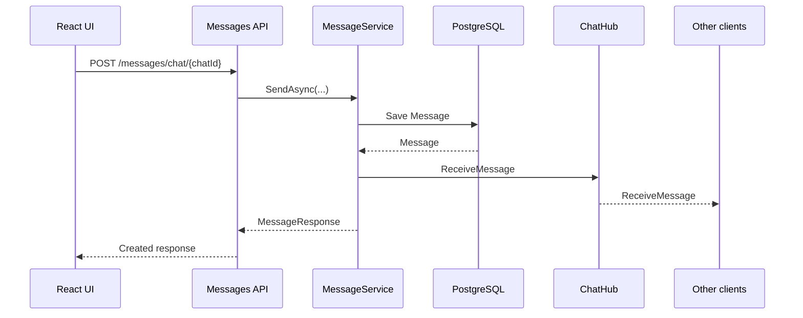
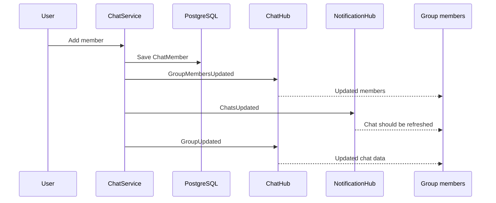

# Realtime communication

## 1. Зачем в проекте SignalR

Messenger должен обновлять состояние интерфейса сразу после изменения данных на сервере.

Вместо того чтобы постоянно опрашивать backend, frontend поддерживает persistent realtime connections через SignalR.

SignalR используется не как замена REST API, а как канал доставки изменений.

```text
REST
→ commands + data retrieval

SignalR
→ realtime propagation of changes
```

---

## 2. Два независимых Hub

В проекте используются два endpoint:

```text
/chatHub
/notificationHub
```

### ChatHub

Отвечает за события, относящиеся к конкретному чату:

- новые сообщения;
- редактирование сообщений;
- удаление сообщений;
- статусы прочтения;
- изменение участников;
- изменение данных группы.

### NotificationHub

Отвечает за события, адресованные конкретному пользователю:

- обновление списка чатов;
- новое уведомление;
- изменение unread count;
- удаление группы;
- обновление пользовательских данных.

Оба Hub требуют авторизацию.

---

## 3. Chat groups

Каждый чат сопоставляется с SignalR group по идентификатору чата.

```text
Chat #123
    ↓
SignalR Group "123"
    ├── connection A
    ├── connection B
    └── connection C
```

Подключение может присоединиться к группе через `JoinGroup`, а затем покинуть её через `LeaveGroup`.

Broadcast chat-level событий выполняется через:

```text
Clients.Group(chatId)
```

---

## 4. User-targeted notifications

NotificationHub использует адресацию:

```text
Clients.User(userId)
```

Это позволяет отправлять событие конкретному пользователю независимо от того, какой чат у него открыт.

---

## 5. Основные realtime-события

| Событие | Канал | Назначение |
|---|---|---|
| `ReceiveMessage` | ChatHub | Новое сообщение в чате |
| `MessageEdited` | ChatHub | Сообщение изменено |
| `MessageDeleted` | ChatHub | Сообщение удалено |
| `MessageRead` | ChatHub | Изменился read status |
| `GroupMembersUpdated` | ChatHub | Изменился состав группы |
| `GroupUpdated` | ChatHub | Изменилась группа |
| `ChatsUpdated` | NotificationHub | Нужно обновить информацию о чате |
| `GroupCreated` | NotificationHub | Создана новая группа |
| `GroupDeleted` | NotificationHub | Группа удалена |
| `ExcludedFromChat` | NotificationHub | Пользователь удалён / вышел |
| `UpdateUnreadCount` | NotificationHub | Изменилось количество непрочитанных |
| `ReceiveNotification` | NotificationHub | Пользовательское уведомление |
| `UserUpdated` | NotificationHub / user-targeted | Изменились данные пользователя |

Frontend подписывается на соответствующие события через `connection.on(...)` и снимает подписки через `connection.off(...)` при очистке component lifecycle.

---

## 6. Отправка сообщения

В текущей архитектуре сохранение сообщения и его realtime-распространение разделены.



Перед отправкой backend проверяет существование чата, пользователя и членство пользователя в чате.

---

## 7. Редактирование и удаление

Для редактирования после сохранения результата backend отправляет:

```text
MessageEdited
```

Для удаления используется soft delete на уровне `Message.IsDeleted`, после чего участникам чата отправляется:

```text
MessageDeleted
```

Это позволяет не удалять историческую запись сообщения физически из базы данных в рамках обычного удаления сообщения.

---

## 8. Read status

Read state изменяет не само сообщение, а связанную с ним пользовательскую запись `MessageReadStatus`.

После batch marking backend:

1. проверяет membership пользователя;
2. выбирает сообщения, которые ещё не были отмечены как прочитанные;
3. создаёт соответствующие read-status записи;
4. сообщает участникам чата через `MessageRead`;
5. обновляет персональный unread count через `UpdateUnreadCount`.

---

## 9. Group updates

Изменения группы могут порождать сразу несколько типов событий.

Например, добавление участника:



Такая схема позволяет отдельно обновить участников, информацию о чате и список чатов.

---

## 10. Connection lifecycle

Frontend создаёт connection только для соответствующего пользователя и использует:

```text
withAutomaticReconnect()
```

Это настроено как для chat connection, так и для notification connection.

При завершении lifecycle соответствующие connection останавливаются, а обработчики событий снимаются.

---

## 11. Frontend subscriptions

Пример концепции:

```text
component mount
    ↓
get existing SignalR connection
    ↓
connection.on("ReceiveMessage", handler)
connection.on("MessageRead", handler)
connection.on("MessageEdited", handler)
connection.on("MessageDeleted", handler)
    ↓
component unmount
    ↓
connection.off(...)
```

Такой подход важен, чтобы повторные render / mount не создавали дублирующиеся event handlers.

---

## 12. Что остаётся за REST

Realtime не является источником истины для истории сообщений.

Например, после reload клиент снова получает сообщения через API.

Это даёт разделение:

```text
PostgreSQL
    ↓
source of persisted state

REST
    ↓
initial / historical state

SignalR
    ↓
state changes after connection is active
```
